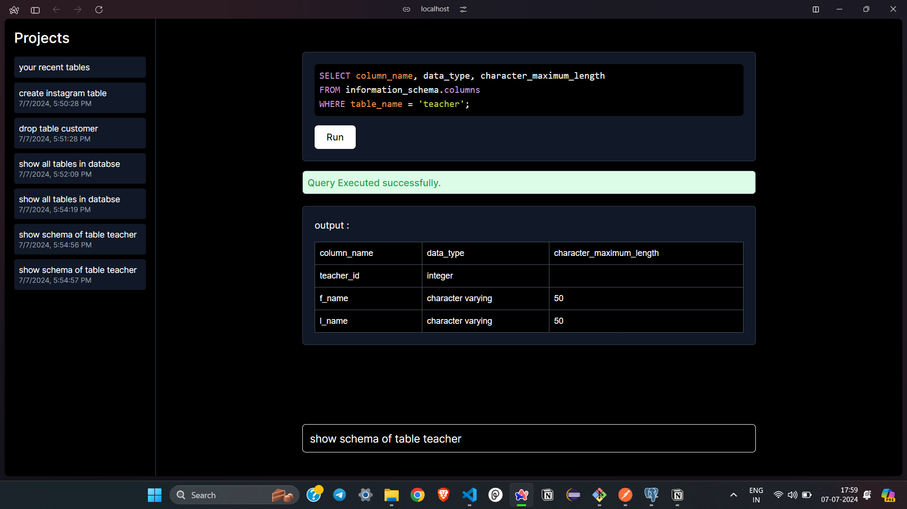

# scul.ai : Natural Language SQL Query Desktop App

This is a desktop application built with Next.js that allows users to query a PostgreSQL database using natural language. The application leverages the GROQ LLM API to access the LLaMA-3 model for converting natural language input into SQL queries, which are then executed against a PostgreSQL database. The stack used includes Next.js, TypeScript, Tailwind CSS, React, PostgreSQL, and Prisma for database management.

## Features

- Convert natural language to SQL queries using LLaMA-3 via the GROQ LLM API
- Execute SQL queries against a PostgreSQL database
- User-friendly interface with real-time feedback
- Built with modern technologies: Next.js, TypeScript, Tailwind CSS, React
- Database management with Prisma

## Technologies Used

- **Next.js**: A React framework for server-side rendering and generating static websites.
- **TypeScript**: A superset of JavaScript that adds static typing to the language.
- **Tailwind CSS**: A utility-first CSS framework for rapidly building custom designs.
- **React**: A JavaScript library for building user interfaces.
- **PostgreSQL**: An open-source relational database management system.
- **Prisma**: A next-generation ORM for Node.js and TypeScript.
- **GROQ LLM API**: Used for accessing the LLaMA-3 model for natural language processing.

## Prerequisites

- Node.js (v14 or higher)
- PostgreSQL (v12 or higher)
- Yarn or npm